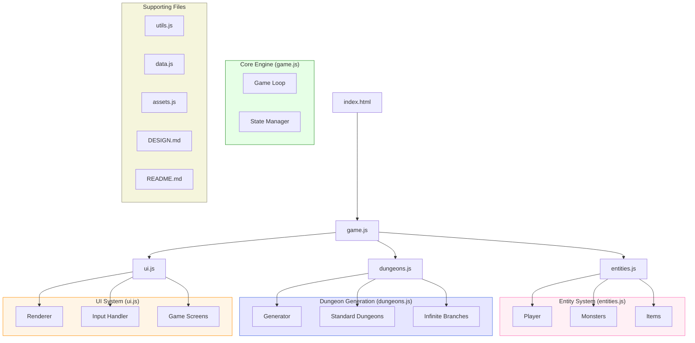
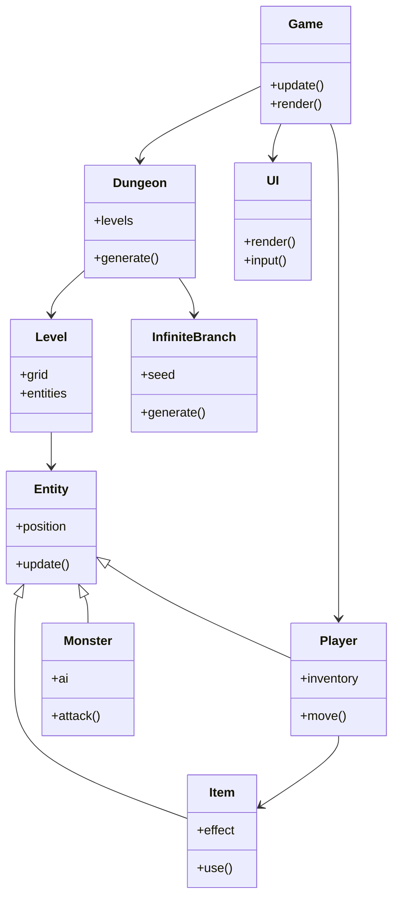
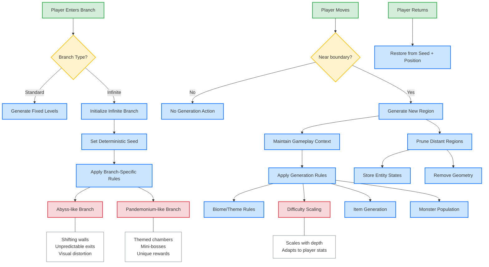

# Browser Roguelike Design Document

## Project Overview

This document outlines the architecture and design for a browser-based roguelike game inspired by Dungeon Crawl Stone Soup (DCSS), but with a smaller scope to fit within a 10-file constraint. The game leverages HTML5 Canvas and JavaScript to create a turn-based dungeon crawler with procedural generation and infinite exploration capabilities.

## Core Design Philosophy

- **Minimalist Codebase**: All game code, documentation, and design must fit within 10 files.
- **Procedural Generation**: Dynamic, replayable content through algorithmic level creation.
- **Turn-Based Gameplay**: Strategic combat without time pressure.
- **Permadeath**: True to roguelike tradition, death is permanent.
- **Branching Exploration**: Multiple dungeon paths with varied difficulty and rewards.
- **Infinite Branches**: Some dungeon branches can be explored infinitely.

## System Architecture

The game is structured across several interconnected systems:

### File Structure

1. `index.html` - Main container and game entry point
2. `game.js` - Core game engine and main loop
3. `entities.js` - Player, monster, and item definitions
4. `dungeons.js` - Dungeon generation systems
5. `ui.js` - User interface rendering and input handling
6. `assets.js` - Asset management for graphics and sounds
7. `DESIGN.md` - This design document
8. `README.md` - Installation and getting started guide
9. `utils.js` - Utility functions and algorithms
10. `data.js` - Game data and configuration

### Architecture Diagram

### Class Relationships

### Data Flow

### Infinite Dungeon Generation

## Game Mechanics

### Player Character

- **Stats**: Health, Attack, Defense, Magic
- **Inventory**: Limited inventory slots with weight/size restrictions
- **Progression**: Experience levels with skill improvements
- **Actions**: Move, Attack, Use Item, Rest, Interact

### Dungeon Structure

The dungeon consists of several key areas:

1. **Main Dungeon**: Linear progression through increasingly difficult floors
2. **Standard Branches**: Optional paths with unique themes and challenges
3. **Infinite Branches**: Special areas that can be explored without limit:
   - **Abyss-like**: Constantly shifting random topology
   - **Pandemonium-like**: Themed chambers with specific challenges

### Combat System

- **Turn-based**: Player and monsters take alternating turns
- **Tactical positioning**: Movement and positioning matter
- **Damage calculation**: Based on attack, defense, and random factors
- **Special abilities**: Both player and monsters have unique attacks

### Item System

- **Weapons**: Melee and ranged options with varying damage profiles
- **Armor**: Protection against damage
- **Consumables**: One-time use items for various effects
- **Scrolls and Potions**: Magical items with powerful effects

## Technical Implementation

### Rendering Approach

The game uses HTML5 Canvas for rendering, with a tile-based approach:

- Each game element is represented by a sprite
- The visible area is centered on the player
- Only visible tiles are rendered
- Field of view calculations determine what the player can see

### Infinite Dungeon Implementation

To manage potentially infinite exploration areas while respecting browser memory limitations:

1. **Chunking**: The world is divided into grid chunks
2. **Deterministic Generation**: Each chunk is generated from a seed based on its coordinates
3. **Memory Management**:
   - Only chunks near the player are kept in memory
   - Distant chunks are serialized and stored
   - When a player returns to a previously visited area, the chunk is regenerated with the same seed
   - Important changes (like killed monsters or collected items) are tracked separately

### Save System

- **Local Storage**: Game state is saved to browser's localStorage
- **Auto-save**: Game state is saved after significant actions
- **Permadeath**: When character dies, save is deleted

## User Interface

- **Game View**: Main play area showing the dungeon
- **Stats Panel**: Shows player health, stats, and status effects
- **Message Log**: Recent game events and messages
- **Mini-map**: (Optional) Small map showing explored areas
- **Context Menu**: Appears when interacting with objects

## Development Priorities

1. Core engine and game loop
2. Basic dungeon generation
3. Player movement and combat
4. Monster AI
5. Items and inventory
6. Standard branch generation
7. Infinite branch mechanics
8. UI polish and effects