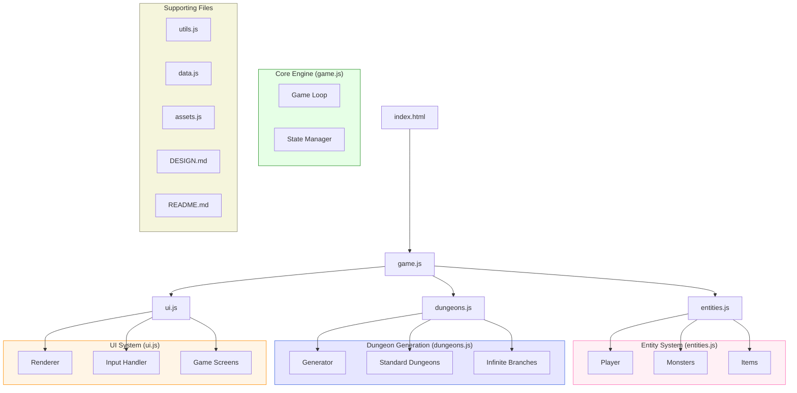
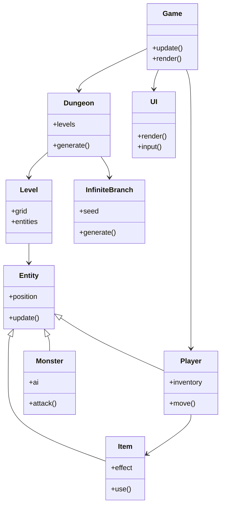
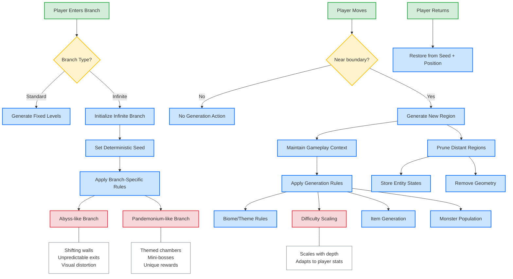

# Browser Roguelike Design Document

## Project Overview

This document outlines the architecture and design for a browser-based roguelike game inspired by Dungeon Crawl Stone Soup (DCSS), but with a smaller scope to fit within a 10-file constraint. The game leverages HTML5 Canvas and JavaScript to create a turn-based dungeon crawler with procedural generation and infinite exploration capabilities.

## Current Implementation Status

- [x] Title screen with ASCII art logo
- [x] Basic project structure and files
- [x] rot.js integration
- [x] Game map generation with proper boundaries
- [x] Player movement mechanics
- [ ] Proper dungeon generation with rooms (in progress)
- [ ] Basic combat system (in progress)
- [ ] Monster AI (in progress)
- [ ] Items and inventory
- [ ] Game progression

## Recent Fixes & Improvements

### Map Boundary Fixes
- Fixed issue with missing right and bottom walls where player could move into undefined areas
- Properly calculated map bounds based on UI space constraints
- Set explicit right wall boundary at x=75 (instead of using display width)
- Added debugging logs for wall generation to verify boundaries
- Added robust movement validation to prevent out-of-bounds movement

### UI Improvements
- Fixed title screen input handling to properly transition to game
- Improved message display in the game area
- Created clear separation between game area and UI elements
- Made sure UI elements don't cover gameplay area
- Added consistent visual styling for walls, floors, and entities

### Core Game Loop Fixes
- Fixed player movement and turn handling
- Implemented proper FOV calculation
- Ensured proper display of visible vs. explored tiles
- Added better logging for debugging

### Key Technical Insights
1. **Proper Boundary Calculation**: The game needed explicit calculation of playable area boundaries that:
   - Accounted for top UI space (2 rows)
   - Accounted for bottom message area (3 rows + 1 divider)
   - Restricted right boundary to x=75 to ensure visibility
   - Used inclusive bounds (minX/maxX, minY/maxY) for clarity

2. **Multiple Validation Layers**: Player movement needed multiple checks:
   - Bounds check (x/y within valid map area)
   - Map content check (tile exists in the map)
   - Tile type check (only allow movement to floor tiles)

3. **Consistent Drawing Order**:
   - Draw UI background first
   - Draw map tiles
   - Draw items on top of map
   - Draw entities on top of items
   - Draw player last (always visible)
   - Draw UI elements and text

## Core Design Philosophy

- **Minimalist Codebase**: All game code, documentation, and design must fit within 10 files.
- **Procedural Generation**: Dynamic, replayable content through algorithmic level creation.
- **Turn-Based Gameplay**: Strategic combat without time pressure.
- **Permadeath**: True to roguelike tradition, death is permanent.
- **Branching Exploration**: Multiple dungeon paths with varied difficulty and rewards.
- **Infinite Branches**: Some dungeon branches can be explored infinitely.

## System Architecture

The game is structured across several interconnected systems:

### File Structure

1. `index.html` - Main container and game entry point
2. `game.js` - Core game engine and main loop
3. `entities.js` - Player, monster, and item definitions
4. `dungeons.js` - Dungeon generation systems
5. `ui.js` - User interface rendering and input handling
6. `assets.js` - Asset management for graphics and sounds
7. `DESIGN.md` - This design document
8. `README.md` - Installation and getting started guide
9. `utils.js` - Utility functions and algorithms
10. `data.js` - Game data and configuration

### Architecture Diagram

### Class Relationships

### Data Flow

### Infinite Dungeon Generation

## Game Mechanics

### Player Character

- **Stats**: Health, Attack, Defense, Magic
- **Inventory**: Limited inventory slots with weight/size restrictions
- **Progression**: Experience levels with skill improvements
- **Actions**: Move, Attack, Use Item, Rest, Interact

### Dungeon Structure

The dungeon consists of several key areas:

1. **Main Dungeon**: Linear progression through increasingly difficult floors
2. **Standard Branches**: Optional paths with unique themes and challenges
3. **Infinite Branches**: Special areas that can be explored without limit:
   - **Abyss-like**: Constantly shifting random topology
   - **Pandemonium-like**: Themed chambers with specific challenges

### Combat System

- **Turn-based**: Player and monsters take alternating turns
- **Tactical positioning**: Movement and positioning matter
- **Damage calculation**: Based on attack, defense, and random factors
- **Special abilities**: Both player and monsters have unique attacks

### Item System

- **Weapons**: Melee and ranged options with varying damage profiles
- **Armor**: Protection against damage
- **Consumables**: One-time use items for various effects
- **Scrolls and Potions**: Magical items with powerful effects

## To-Do List & Features Roadmap

### Critical Fixes
- [x] Fix dungeon rendering after title screen
- [x] Fix player movement and input handling
- [x] Fix FOV calculation and exploration mechanics
- [x] Fix map boundaries to prevent off-screen movement

### Core Gameplay (Phase 1)
- [x] Working dungeon exploration with basic rectangular room
- [x] Turn-based movement
- [ ] Implement proper dungeon generation with multiple rooms
- [ ] Combat mechanics
- [ ] Basic monster AI
- [ ] Death and game over state

### Extended Features (Phase 2)
- [ ] Multiple dungeon branches
- [ ] Inventory system
- [ ] Items and equipment
- [ ] Character progression
- [ ] Monster variety
- [ ] Special abilities

### Polish & UI (Phase 3)
- [ ] Message logging improvements
- [ ] Sound effects
- [ ] UI polish
- [ ] Help screens and tutorials
- [ ] Save/load system

## Technical Implementation

### Rendering Approach

The game uses HTML5 Canvas for rendering, with a tile-based approach:

- Each game element is represented by an ASCII character
- Fixed-width display grid (80x30)
- Top 2 rows reserved for stats and UI
- Bottom 4 rows reserved for messages and divider
- Field of view calculations determine what the player can see
- Right boundary limited to column 75 for optimal display

### Map Generation

The current implementation uses a simple rectangular room with walls as a placeholder. The next step will implement:

1. **Room-based Generation**: Using rot.js's Digger algorithm to create multiple connected rooms
2. **Proper Door Placement**: Connecting rooms with corridors and doors
3. **Monster Placement**: Strategic monster placement in rooms (avoiding the starting room)
4. **Item Placement**: Distributing items throughout the dungeon

## Comparison to DCSS

Compact Crawl aims to maintain the spirit of DCSS while dramatically reducing scope:

| Feature | DCSS | Compact Crawl |
|---------|------|---------------|
| Races | 27+ | None (human only) |
| Classes | 26+ | None (fighter only) |
| Dungeon Branches | 18+ | 3-5 |
| Items | Hundreds | Dozens |
| Gods | 24+ | None |
| Magic System | Complex, 8 schools | None |
| File Count | Thousands | 10 |

## Development Process

### Current Development Phase
**Early Development - Core Gameplay**

Our current milestone is getting the basic dungeon exploration working:
1. Title screen (✓ Completed)
2. Basic map with proper boundaries (✓ Completed)
3. Player movement and FOV (✓ Completed)
4. Turn-based game loop (✓ Completed)
5. Basic monster placement and AI (In Progress)
6. Basic combat mechanics (In Progress)

### Testing and Debugging

Current focus areas:
1. Implement proper dungeon generation with multiple rooms
2. Add monster AI for combat and movement
3. Implement basic item system

## Future Considerations

- Performance optimization for larger dungeons
- Mobile/touch support
- Highscore system
- Daily challenges

---

Document updated: July 2023