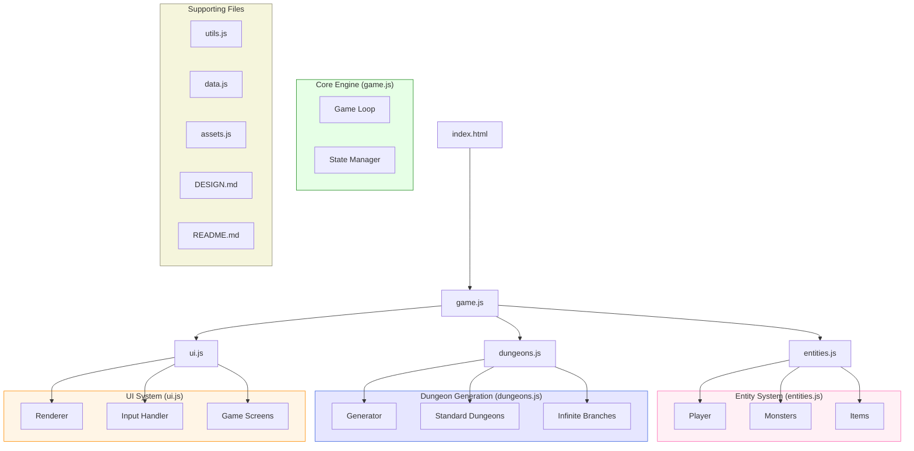
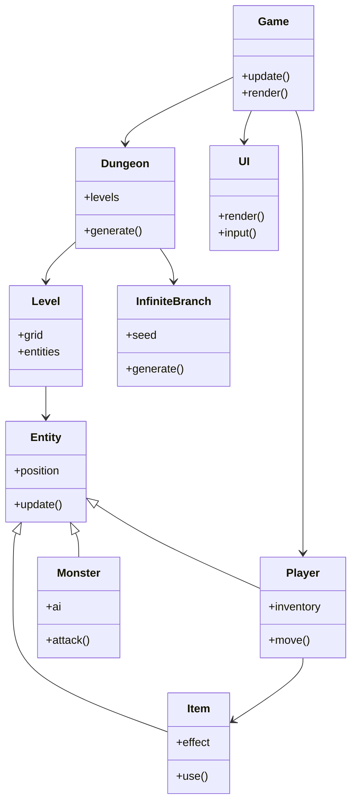
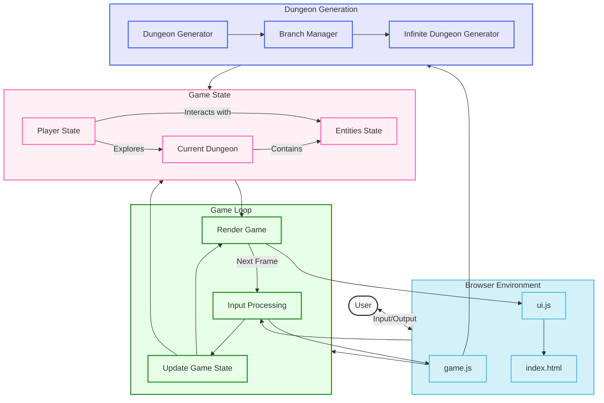
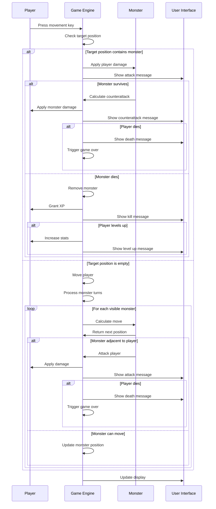
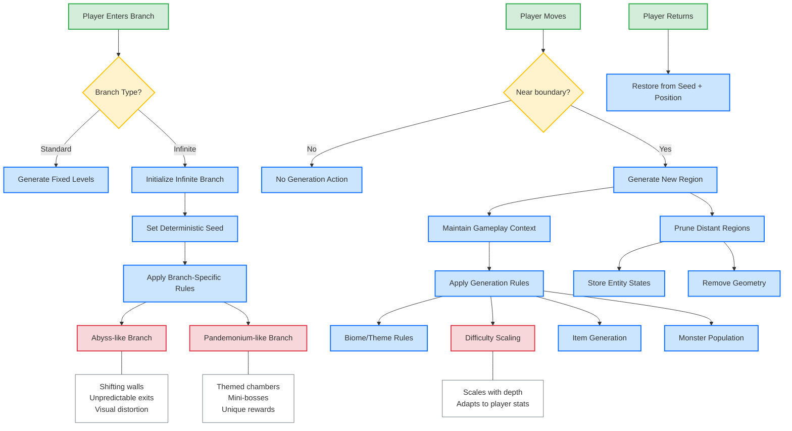

# Browser Roguelike Design Document

## Project Overview

This document outlines the architecture and design for a browser-based roguelike game inspired by Dungeon Crawl Stone Soup (DCSS), but with a smaller scope to fit within a 10-file constraint. The game leverages HTML5 Canvas and JavaScript to create a turn-based dungeon crawler with procedural generation and infinite exploration capabilities.

## Current Implementation Status & Roadmap

### Completed Features
- [x] Title screen with ASCII art logo
- [x] Basic project structure and files
- [x] rot.js integration
- [x] Game map generation with proper boundaries
- [x] Player movement mechanics
- [x] Monster movement and AI
- [x] Basic combat system
- [x] Death and game restart

### In Progress (Core Gameplay - Phase 1)
- [ ] Proper dungeon generation with multiple rooms
- [ ] Doors and corridors
- [ ] More monster types and behaviors

### Planned Features (Phase 2)
- [ ] Multiple dungeon branches
- [ ] Inventory system
- [ ] Items and equipment
- [ ] Character progression
- [ ] Advanced monster AI

### Polish & UI (Phase 3)
- [ ] Message logging improvements
- [ ] Sound effects
- [ ] UI polish
- [ ] Help screens and tutorials
- [ ] Save/load system

## Implementation & Debugging Logs

### Entity Collision Detection (July 2023)

**Issue**: Players could walk over monsters, and monsters could occupy the same position.

**Solution**: Implemented proper entity collision detection:
1. Added boundary checks in both player and monster movement logic
2. Created separate `isValidMove` method for monsters that checks for occupied tiles
3. Added a direct check for entities at target position in player movement code

**Key debugging insight**: Used console logs for movement attempts to identify collision detection failures:
```javascript
console.log(`Moving monster from (${entity.x},${entity.y}) to (${newX},${newY})`);
console.log(`Monster can't move to occupied position (${newX},${newY})`);
```

### Monster AI (July 2023)

**Issue**: Monsters didn't move toward the player or attack.

**Solution**:
1. Implemented A* pathfinding using rot.js
2. Created visibility check for monsters (only visible monsters move)
3. Implemented monster-to-player distance checks for attacks
4. Added proper turn sequencing (player moves, then monsters move)

**Debugging technique**: Added extensive logging to track monster decisions:
```
Processing monster at 16,15, visible: true
Monster has meleeMovement method, calling it
goblin performing melee movement
Monster path next position: 15,15
goblin moving to 15,15
```

### Combat System (July 2023)

**Issue**: Combat needed to account for stats and provide feedback.

**Solution**:
1. Added damage calculations using attack and defense stats
2. Implemented HP tracking for both player and monsters
3. Created message feedback system for combat
4. Added death detection and game over state

**Implementation detail**:
```javascript
attackEntity(entity) {
    const damage = Math.max(1, this.player.attack - (entity.defense || 0));
    entity.hp -= damage;
    
    this.addMessage(`You hit the ${entity.name} for ${damage} damage.`);
    
    if (entity.hp <= 0) {
        // Monster death logic, XP gain, etc.
    } else {
        // Monster counter-attack
        const entityDamage = Math.max(1, entity.attack - this.player.defense);
        this.player.hp -= entityDamage;
    }
}
```

### Game Over & Restart (July 2023)

**Issue**: Game couldn't be restarted after player death.

**Solution**:
1. Properly cleaned up event handlers to prevent duplicates
2. Added a global reset function to restore default game state
3. Implemented multiple restart paths (timeout, keypress, title screen)
4. Fixed the title screen handler to properly reinitialize the game

**Debug logging**: Tracked the game state transitions during restart:
```
Game state changed from 'gameover' to 'title'
Removed keydown handlers to prevent duplicates
Re-added title screen input handler
```

### Global Game Reference Issue (July 2023)

**Issue**: Monster class couldn't reliably access game state.

**Solution**:
1. Used `window.game` instead of local `game` variable in Monster methods
2. Added null checks to prevent errors when accessing game data
3. Ensured game instance is properly initialized before monsters reference it

**Code fix**:
```javascript
getPathToPlayer() {
    const game = window.game;
    if (!game || !game.player) {
        console.error("Game or player not found");
        return [];
    }
    // Path calculation code...
}
```

## Recent Technical Improvements

### Key Technical Insights
1. **Entity Collision Resolution**: Implemented a multi-layer collision detection system:
   - Map boundary checks (prevent movement outside valid area)
   - Tile type checks (prevent walking into walls)
   - Entity occupation checks (prevent multiple entities on same tile)
   - Special case for player-monster collisions to trigger combat

2. **Monster AI Optimization**: Monsters now use a staged decision process:
   - First check if monster is in player's field of view
   - Then check if monster is adjacent to player for attack
   - If not adjacent, calculate path to player using A*
   - Only visible monsters process movement to save computation

3. **Game State Management**: Implemented clean state transitions between:
   - Title screen
   - Active gameplay
   - Game over
   - Restart sequence

### Testing and Debugging Focus
Current debugging focus areas:
1. Ensure monster movement is smooth and predictable
2. Balance combat difficulty
3. Fix any remaining restart/state transition bugs

## Core Design Philosophy

- **Minimalist Codebase**: All game code, documentation, and design must fit within 10 files.
- **Procedural Generation**: Dynamic, replayable content through algorithmic level creation.
- **Turn-Based Gameplay**: Strategic combat without time pressure.
- **Permadeath**: True to roguelike tradition, death is permanent.
- **Branching Exploration**: Multiple dungeon paths with varied difficulty and rewards.
- **Infinite Branches**: Some dungeon branches can be explored infinitely.

## System Architecture

The game is structured across several interconnected systems:

### File Structure

1. `index.html` - Main container and game entry point
2. `game.js` - Core game engine and main loop
3. `entities.js` - Player, monster, and item definitions
4. `dungeons.js` - Dungeon generation systems
5. `ui.js` - User interface rendering and input handling
6. `assets.js` - Asset management for graphics and sounds
7. `utils.js` - Utility functions and algorithms
8. `data.js` - Game data and configuration
9. `DESIGN.md` - This design document
10. `README.md` - Installation and getting started guide

### Architecture Diagram



### Class Relationships



### Data Flow



### Enhanced Combat Sequence Diagram



### Infinite Dungeon Generation



## Game Mechanics

### Player Character

- **Stats**: Health, Attack, Defense, Magic
- **Inventory**: Limited inventory slots with weight/size restrictions
- **Progression**: Experience levels with skill improvements
- **Actions**: Move, Attack, Use Item, Rest, Interact

### Dungeon Structure

The dungeon consists of several key areas:

1. **Main Dungeon**: Linear progression through increasingly difficult floors
2. **Standard Branches**: Optional paths with unique themes and challenges
3. **Infinite Branches**: Special areas that can be explored without limit:
   - **Abyss-like**: Constantly shifting random topology
   - **Pandemonium-like**: Themed chambers with specific challenges

### Combat System

- **Turn-based**: Player and monsters take alternating turns
- **Tactical positioning**: Movement and positioning matter
- **Damage calculation**: Based on attack, defense, and random factors
- **Special abilities**: Both player and monsters have unique attacks

### Item System

- **Weapons**: Melee and ranged options with varying damage profiles
- **Armor**: Protection against damage
- **Consumables**: One-time use items for various effects
- **Scrolls and Potions**: Magical items with powerful effects

## Technical Implementation

### Rendering Approach

The game uses HTML5 Canvas for rendering, with a tile-based approach:

- Each game element is represented by a sprite
- The visible area is centered on the player
- Only visible tiles are rendered
- Field of view calculations determine what the player can see

### Infinite Dungeon Implementation

To manage potentially infinite exploration areas while respecting browser memory limitations:

1. **Chunking**: The world is divided into grid chunks
2. **Deterministic Generation**: Each chunk is generated from a seed based on its coordinates
3. **Memory Management**:
   - Only chunks near the player are kept in memory
   - Distant chunks are serialized and stored
   - When a player returns to a previously visited area, the chunk is regenerated with the same seed
   - Important changes (like killed monsters or collected items) are tracked separately

### Save System

- **Local Storage**: Game state is saved to browser's localStorage
- **Auto-save**: Game state is saved after significant actions
- **Permadeath**: When character dies, save is deleted

## User Interface

- **Game View**: Main play area showing the dungeon
- **Stats Panel**: Shows player health, stats, and status effects
- **Message Log**: Recent game events and messages
- **Mini-map**: (Optional) Small map showing explored areas
- **Context Menu**: Appears when interacting with objects

## Technical Implementation Notes

### Monster Pathfinding Implementation

```javascript
// A* pathfinding setup
const astar = new ROT.Path.AStar(
    playerX, playerY,
    (x, y) => {
        // Position is valid if:
        // 1. In map boundaries
        // 2. Not a wall
        // 3. Not occupied by another entity (except player)
        const key = `${x},${y}`;
        if (!(key in game.map) || game.map[key] === '#') return false;
        
        for (const entity of game.entities) {
            if (entity !== monster && entity !== game.player && entity.x === x && entity.y === y) {
                return false;
            }
        }
        
        return true;
    },
    { topology: 4 } // Only cardinal directions, no diagonals
);

// Compute path
const path = [];
astar.compute(monster.x, monster.y, (x, y) => {
    path.push([x, y]);
});

// First position is current position, second is next move
if (path.length > 1) {
    const [nextX, nextY] = path[1];
    // Move logic here...
}
```

### Combat Calculation Logic

```javascript
// Player attacks monster
function attackMonster(player, monster) {
    // Calculate base damage using player attack and monster defense
    const baseDamage = player.attack - monster.defense;
    // Ensure at least 1 damage
    const damage = Math.max(1, baseDamage);
    
    // Apply damage
    monster.hp -= damage;
    
    // Return combat result for message display
    return {
        damage,
        killed: monster.hp <= 0
    };
}

// Monster attacks player
function monsterAttack(monster, player) {
    // Calculate base damage using monster attack and player defense
    const baseDamage = monster.attack - player.defense;
    // Ensure at least 1 damage
    const damage = Math.max(1, baseDamage);
    
    // Apply damage
    player.hp -= damage;
    
    // Return combat result for message display
    return {
        damage,
        killed: player.hp <= 0
    };
}
```

### Entity Collision Detection Process

1. **Boundary Check**: Ensure coordinates are within map boundaries
   ```javascript
   if (x < bounds.minX || x > bounds.maxX || y < bounds.minY || y > bounds.maxY) return false;
   ```

2. **Wall Check**: Ensure position is not a wall
   ```javascript
   const key = `${x},${y}`;
   if (map[key] === '#') return false;
   ```

3. **Entity Collision Check**: Ensure no entities occupy the position
   ```javascript
   for (const entity of entities) {
       if (entity !== self && entity.x === x && entity.y === y) return false;
   }
   ```

4. **Special Case**: Allow player and monster to occupy same tile for combat
   ```javascript
   if (entity === player) return true; // Allow moving onto player for attacks
   ```

---

Document updated: July 2023